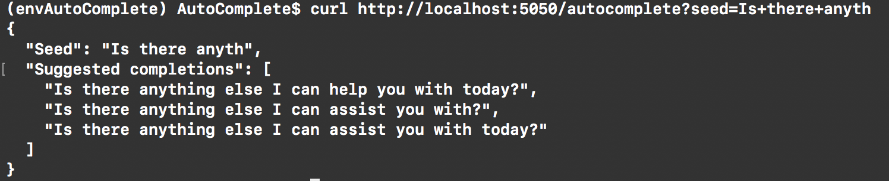

# Goal
Design and implement  an auto-complete server using the sample chat histories in input\_files/conversations.json **that would be useful to a real customer service agent**.

## To run the code on a computer (with CPU)

### Git clone the code
```
git clone https://github.com/ArbinTimilsina/AutoCompleteAgent.git
cd AutoCompleteAgent
```

### Create a conda environment (Python 3)
```
conda update -n base conda
conda env create -f requirements/cpu_requirements.yml
conda activate envAutoCompleteAgent
```

### Switch Keras backend to TensorFlow
```
KERAS_BACKEND=tensorflow python -c "from keras import backend"
```

### Create an IPython kernel for the environment
```
python -m ipykernel install --user --name envAutoCompleteAgent --display-name "envAutoCompleteAgent"
```

### To train the model, do
```
python train_model.py
``` 

### To use the model, do
```
python run_server.py
```
and then curl the following in a new terminal (or paste into a web browser)
```
http://localhost:5050/autocomplete?seed=Is+there+anyth
```

You will get output similar to 



Replace the string after ```?seed=``` to change the seed and see suggested completions!

###  To experiment and play with a copy of the inner workings, do
```
jupyter notebook model_creation_playground.ipynb
```
Make sure to change the kernel to envAutoComplete using the drop-down menu (Kernel > Change kernel > envAutoCompleteAgent)
